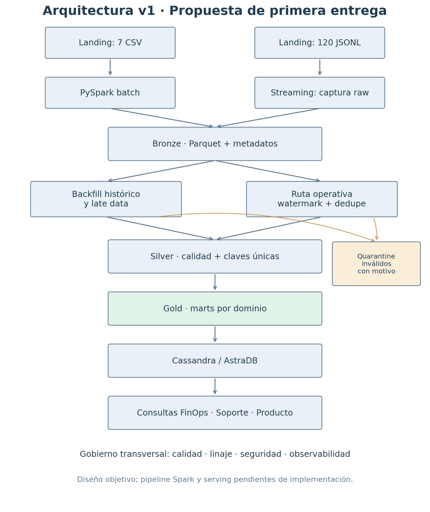

# Cloud Provider Analytics · Diseño de la primera entrega

**Ramón Ojea · Minería de Datos II · ISTEA · 2C 2026**  
Fecha de elaboración: 06/10/2026. Propuesta individual para comparar y consolidar dentro del grupo.

## 1. Problema, usuarios y objetivos

El proveedor tiene información repartida entre eventos de consumo, maestros de clientes y recursos, facturación, tickets y encuestas. Una suma directa sobre los archivos puede producir cifras engañosas: hay números como texto, datos ausentes, costos negativos y monedas que necesitan una interpretación explícita.

Propongo un pipeline que conserve los originales, haga visibles los problemas de calidad y publique resultados por organización. La prioridad es que cada indicador se pueda explicar y reproducir.

| Usuario | Pregunta | Resultado y decisión |
|---|---|---|
| FinOps | ¿Cuánto consume una organización por día y servicio? ¿Cuáles son sus servicios más caros en 14 días? | Mart diario; revisar sobrecostos y eficiencia |
| FinOps | ¿Cuál es su revenue mensual después de créditos, impuestos y conversión a USD? | Mart mensual; auditar importes y FX |
| Soporte | ¿Cómo evolucionan los tickets críticos y el incumplimiento de SLA en 30 días? | Mart de tickets; priorizar cuentas y guardias |
| Producto | ¿Cómo evoluciona GenAI en tokens y costo diario? | Mart GenAI; observar adopción y consumo |

| ID | Objetivo medible para la implementación | Evidencia de aceptación |
|---|---|---|
| O1 | Registrar el 100 % de las filas recibidas | Conteos de entrada = aceptados + rechazados + duplicados contabilizados |
| O2 | Reprocesar sin modificar costos ni multiplicar eventos | Dos corridas con mismas claves, conteos y totales de negocio |
| O3 | Unificar v1/v2 sin inventar datos de v1 | Esquema común; carbono/tokens ausentes siguen nulos |
| O4 | Evaluar calidad y conservar el motivo de rechazo | Métricas por regla y quarantine trazable |
| O5 | Responder las cinco consultas mínimas | CQL y resultados desde Cassandra/AstraDB |
| O6 | Disponibilidad operativa ≤15 min desde llegada a Landing | Latencia de llegada a serving medida por lote; meta propuesta |
| O7 | Reproducir desde entorno limpio | Quickstart, versiones, configuración y salidas esperadas |

Esta entrega ejecuta la exploración y el MapReduce de referencia. La arquitectura de las secciones siguientes es un diseño pendiente de implementación.

## 2. Análisis de las 5V

| V | Evidencia del caso | Decisión que justifica |
|---|---|---|
| Volumen | 43.200 eventos; cerca de 13 MB de archivos de eventos. Es una muestra pequeña | Parquet y Spark como fundamento del proyecto y escalabilidad futura; no afirmar que la muestra exige un cluster |
| Velocidad | 120 archivos de 360 eventos; cada archivo mezcla 59–60 fechas | Structured Streaming para llegada, checkpoint y separación de histórico/operativo |
| Variedad | 7 CSV, JSONL, JSON embebido, tres monedas y dos versiones de esquema | Contrato por fuente, tipos explícitos y conformado Silver |
| Veracidad | 1.309 `value` texto, 877 nulos, 216 costos negativos y FX inconsistente | Casteo controlado, flags, quarantine y decisiones financieras documentadas |
| Valor | Costos, revenue, SLA y adopción GenAI responden preguntas de tres áreas | Gold por dominio y tablas de serving diseñadas desde las consultas |

Velocidad y veracidad son las dimensiones que más condicionan el diseño. Para dimensionar una escala futura, un escenario hipotético de 100.000 recursos × 3 métricas × 288 mediciones/día produce 86,4 millones de eventos diarios. A aproximadamente 300 bytes por evento serían 25,9 GB/día sin comprimir. Es una proyección de trabajo, no una medición del dataset ni una exigencia del profesor.

## 3. Inventario y perfil de fuentes

| Fuente | Filas | Grano / clave | Frecuencia propuesta | Riesgo principal |
|---|---:|---|---|---|
| `customers_orgs.csv` | 80 | Organización / `org_id` | Snapshot diario | NPS ausente y escala ambigua |
| `users.csv` | 800 | Usuario / `user_id` | Snapshot diario | Fechas incoherentes y email sensible |
| `resources.csv` | 400 | Recurso / `resource_id` | Snapshot diario | JSON embebido; 83 tags ausentes |
| `support_tickets.csv` | 1.000 | Ticket / `ticket_id` | Actualización diaria | Abiertos, CSAT ausente o fuera de escala propuesta |
| `marketing_touches.csv` | 1.500 | Interacción / `touch_id` | Diario | Booleanos y timestamps por validar |
| `nps_surveys.csv` | 92 | Encuesta / `(org_id, survey_date)` | Periódica | 19 NPS ausentes; escala a confirmar |
| `billing_monthly.csv` | 240 | Factura / `invoice_id`; validar org-mes | Mensual | Créditos ausentes, FX y subtotales negativos |
| `usage_events_stream` | 43.200 | Evento / `event_id` | Micro-lotes simulados | Desorden temporal, tipos y v1/v2 |

Las frecuencias son supuestos operativos: los CSV provistos son un único corte y los JSONL no contienen un timestamp real de llegada. El período de uso va del 03/07 al 31/08/2025; billing cubre junio, julio y agosto. Julio tiene cobertura parcial de eventos, por lo que una diferencia con billing no demuestra un error de facturación.

### Tipos y contrato inicial

IDs y categorías: `string`. Fechas: `date` o `timestamp` UTC según su grano. Booleanos: `boolean`, con vocabulario de entrada validado. Números de consumo: `double`; tokens: `long`. Importes: `decimal`, con precisión a definir para Spark (propuesta `decimal(20,6)`). Tags: `array<string>` después de interpretar correctamente el CSV. Comentarios y email permanecen en zonas restringidas.

Para medir casteabilidad se preserva la representación de entrada: `value` debe poder recibirse como string además de número. Un esquema que lo declare `double` desde el principio puede convertir texto válido en nulo antes del cast controlado. La implementación probará entradas numéricas y textuales con un esquema de captura compatible.

### Hallazgos verificados

| Hallazgo | Cantidad | Decisión |
|---|---:|---|
| `value` como texto / fallas al convertir | 1.309 / 0 | Convertir con flag de conversión; conservar raw |
| `value` nulo | 877 | Conservar nulo; sumar valores conocidos y publicar completitud |
| `unit` nula | 2.075 | Inferir solo con relación metric-unit validada |
| Costo negativo | 216 | Mantener y marcar; confirmar si es ajuste legítimo |
| Costo >100 USD | 48 | Indicador exploratorio; el umbral final será por servicio |
| `event_id` duplicado / FK huérfana | 0 / 0 | Control obligatorio aunque hoy no tenga casos |
| `tags_json` no vacío y parseable | 317 / 317 | Usar parser JSON; revisar escape/quote de Spark, no reparar con regex |
| Subtotal negativo | 13 | Flag y revisión; conservar importe firmado |
| Créditos ausentes | 137 | Propuesta cero con flag; supuesto a validar |
| Facturas USD con FX distinto de 1 | 160 | FX efectivo =1, preservar FX original y marcar inconsistencia |
| Login anterior a creación | 232 | Flag, sin modificar fechas arbitrariamente |
| Ticket abierto / CSAT nulo | 240 / 254 | Abierto es estado válido; CSAT usa denominador de valores válidos |
| CSAT fuera de 1–5 | 40 | Escala 1–5 es propuesta pendiente, no descartar tickets completos |

Los 40 CSAT incluyen ceros y valores mayores que cinco. Por eso el conteo difiere de un control que únicamente busca `csat > 5`. NPS se conservará como recibido; el nombre del campo no permite saber si representa una respuesta 0–10 o un índice agregado −100–100. No se calculará un NPS estándar sin confirmar ese contrato.

V1 tiene 10.800 eventos; v2, 32.400. V2 comienza el 18/07/2025 e incorpora carbono y tokens GenAI cuando corresponden. Un nulo de v1 significa que esa medición no estaba disponible; no equivale a cero.

## 4. Arquitectura v1 y componentes

La fuente editable del diagrama es [arquitectura_v1.mmd](arquitectura_v1.mmd).

Landing conserva los archivos originales. La captura batch y streaming escribe Bronze con tipos controlados, representación raw y metadatos. Silver concentra calidad, deduplicación definitiva y joins con dimensiones. Gold agrega por grano de negocio. Cassandra/AstraDB sirve consultas predefinidas sin joins en tiempo de lectura.

Gobierno transversal: conteos por corrida, reglas y rechazos, catálogo, fuentes, hashes, registro de decisiones, permisos por zona, secretos externalizados y métricas de latencia/archivos/errores. No se propone Airflow para esta primera etapa; la ejecución manual con comandos claros es suficiente y evita sumar infraestructura sin una necesidad medida.

## 5. Patrón y política temporal

Se elige un **híbrido de batch y streaming, con reconciliación batch**. Tiene rasgos de Lambda por sus dos ritmos, pero comparte las transformaciones y los marts para reducir divergencias. Kappa no aporta una ventaja clara para maestros y facturación mensual. Solo batch incumpliría el requisito de streaming.

### Histórico, watermark y eventos tardíos

La simulación toma los archivos en orden lexicográfico, uno por lote. Compara cada evento con el máximo timestamp de lotes anteriores menos el margen.

| Margen | Porcentaje por debajo del umbral |
|---|---:|
| 1 hora | 99,076 % |
| 2 horas | 99,035 % |
| 1 día | 97,495 % |
| 7 días | 87,572 % |
| 30 días | 49,586 % |
| 60 días | 0 % |

Estos porcentajes son una **aproximación temporal**, no un descarte observado en Spark. El orden de descubrimiento de archivos, `maxFilesPerTrigger`, el operador y la actualización efectiva del watermark cambian el resultado. Un watermark no descarta por sí solo un append sin estado.

Política propuesta para la segunda entrega:

1. Capturar todos los eventos en Bronze mediante una query sin descarte temporal y con checkpoint propio.
2. Procesar los 60 días provistos como backfill batch, con `event_id` único en Silver.
3. En la demo operativa, copiar archivos nuevos a un directorio de llegada separado. Mantener `timestamp` original y registrar `arrival_ts` estable en el manifiesto de recepción.
4. Usar una query operativa con watermark sobre **event-time**, inicialmente de dos horas, y `dropDuplicatesWithinWatermark(["event_id"])`. Es un parámetro propuesto que debe verificarse con la distribución de atrasos operativa, no aplicarse ciegamente al histórico.
5. Clasificar en una ruta de reconciliación los eventos fuera del horizonte operativo, leyendo Bronze. Conservarlos y procesarlos batch; no confundir late data con datos inválidos.
6. La reconciliación reconstruye Silver por clave natural y reemplaza los agregados afectados; corrige duplicados incluso fuera del horizonte del dedupe operativo.

La ruta operativa puede dar resultados provisorios. Bronze y el recálculo batch garantizan recuperación del histórico. No se afirma que watermark o checkpoint por sí solos hagan idempotente un sink personalizado.

`foreachBatch` tiene garantías de escritura at-least-once por defecto. La idempotencia exige identidad estable de entrada, claves naturales, salida determinista, checkpoints y manejo explícito de reintentos. Se seguirá la [guía oficial de Spark](https://spark.apache.org/docs/3.5.6/structured-streaming-programming-guide.html).

## 6. Trazabilidad requisito-componente

La [matriz completa](matriz_requisitos.md) relaciona los 12 puntos de la primera entrega con archivos y las metas O1–O7 con componentes futuros. Los objetivos de latencia, idempotencia y serving se documentan como diseño; su evidencia operativa queda para las siguientes instancias.

## 7. Diseño del Data Lake

| Zona | Formato | Grano y partición propuestos | Promoción |
|---|---|---|---|
| Landing | CSV/JSONL originales | Estructura del proveedor, sin modificación | Archivo legible, hash y recepción registrados |
| Bronze | Parquet + Snappy | Eventos por `ingest_date`; maestros por snapshot, sin subdivisiones innecesarias | Parseo tipado, metadatos y conciliación de conteos |
| Silver | Parquet + Snappy | Eventos por `event_month` en esta muestra; dimensiones sin partición; billing por mes | Claves únicas, integridad, calidad y versión compatible |
| Gold | Parquet + Snappy | Marts diarios por mes; revenue por mes | Grano único, métricas reconciliadas y contrato estable |
| Quarantine | Parquet | `ingest_date` | Registro original, reglas, source_file y corrida disponibles |

Elegí particionar Bronze por llegada porque cada lote mezcla casi todo el histórico: hacerlo por fecha de evento multiplicaría las escrituras pequeñas. En Silver/Gold parto por mes en la muestra; fecha diaria es una alternativa a escala mayor después de medir bytes y filtros. El grano diario del mart no obliga a tener una partición física diaria. No se particiona por IDs de alta cardinalidad.

Se controlarán número y tamaño de archivos, `repartition/coalesce` y compactación. Un objetivo de 128–256 MB tiene sentido a escala productiva; no se fabricarán archivos de ese tamaño con una muestra de 13 MB. La primera implementación priorizará pocos archivos, con writer único.

Naming: `datalake/<zona>/<dominio>/<tabla>/<particion>=<valor>/`. Metadatos: `source_file`, `ingest_ts`, `run_id`, `schema_version`, versión de regla y flags `dq_*`. Gold mantiene linaje a la corrida y al conjunto de fuentes; al agregar muchas filas no existe necesariamente un único archivo de origen por fila Gold.

Retención propuesta: conservar Landing durante todo el proyecto; como referencia operativa, 13 meses Landing/Silver, 90 días Bronze/quarantine y 24 meses Gold. Son supuestos configurables, sujetos a requisitos de negocio y privacidad. Los checkpoints se mantienen mientras exista la query; eliminarlos requiere un replay controlado.

### Actualización e idempotencia: decisión de diseño

Parquet no tiene un upsert transaccional. La implementación posterior deberá reconstruir y validar las particiones afectadas con un único writer, publicar versiones consistentes y cargar valores absolutos en Cassandra. Se propone un registro de corridas para detectar reintentos y fallas parciales. Checkpoint, dedupe y primary key son herramientas complementarias, no una garantía automática de idempotencia. El mecanismo operativo se implementará y probará en la segunda entrega.

## 8. Flujos batch y streaming

### Batch

Leer CSV con esquema explícito y opciones CSV verificadas → conservar campos raw y agregar metadatos → castear con fallback medido → Bronze Parquet → reglas/joins con dimensiones → Silver/quarantine → agregación Gold → carga idempotente a Cassandra → registrar conteos y estado. Customers, users y resources son los primeros tres maestros a implementar.

Billing normaliza importes a USD como `(subtotal - credits + taxes) * fx_efectivo`. Propuesta: créditos nulos =0 con flag, USD usa FX=1 y otras monedas su FX provisto validado (>0). Se conservan valores originales, subtotal firmado y banderas. No se deduce que los ARS ya están expresados en USD únicamente por su magnitud. La interpretación financiera y los negativos se consultan al profesor antes de afirmar revenue definitivo.

### Streaming

Directorio de llegada → `readStream.json` con esquema explícito compatible v1/v2 → captura Bronze sin estado → query operativa con watermark/dedupe y checkpoint independiente → calidad/joins stream-static → publicación versionada de Silver → recálculo de marts → upserts en Cassandra. Una tarea batch sobre Bronze reconcilia el histórico y late data.

El checkpoint de la query de captura y el de la query operativa son distintos. Los joins no inventan historial dimensional: el dataset tiene un snapshot actual. SCD tipo 2 queda para cuando existan snapshots sucesivos verificables.

### Marts y consultas objetivo

| Mart | Grano | Métricas |
|---|---|---|
| `org_daily_usage_by_service` | org, día, servicio | Costo USD, requests, CPU/storage, completitud |
| `revenue_by_org_month` | org, mes | Subtotal/créditos/impuestos originales y USD, FX y flags |
| `tickets_by_org_date` | org, día, severidad | Tickets, SLA conocido/incumplido, CSAT válido |
| `genai_tokens_by_org_date` | org, día | Tokens conocidos, eventos con tokens, costo incremental GenAI |
| `cost_anomaly_mart` | org, día, servicio | Flags/score, método y contexto |

El costo diario GenAI se estima inicialmente desde `cost_usd_increment` de eventos GenAI. No hay una tarifa por token provista, así que no se inventa una multiplicación precio×tokens. Requests se obtiene de `value` solo cuando `metric="requests"`. Un nulo no se transforma en una medición cero: se publica suma conocida, cantidad ausente y completitud.

Serving se diseñará desde las consultas mínimas: costo/requests por rango, top-N en 14 días, tickets críticos/SLA en 30 días, revenue mensual y tokens/costo GenAI diario. Las tablas usarán claves de organización y buckets de tiempo, evitando joins y `ALLOW FILTERING`; sus esquemas CQL y evidencias corresponden a etapas posteriores. Para la demo los rangos se anclarán al máximo día del dataset, no a la fecha actual.

Para anomalías se propone un método robusto por servicio, como MAD. El umbral >100 USD usado aquí es exploratorio; la selección y validación del método final queda pendiente.

## 9. MapReduce de referencia

Se usa el mart de costos diarios porque tiene una clave clara y sumas verificables. La implementación está en `src/exploracion.py`; no requiere Hadoop ni ejecuta Spark.

| Fase | Operación |
|---|---|
| Split | 120 archivos, 360 eventos cada uno |
| Map | Emitir `(org_id, fecha UTC, service)` y costo, métricas conocidas, conteo y faltantes |
| Combiner | Sumar por clave dentro de cada archivo |
| Shuffle conceptual | Reunir valores de la misma clave; en Spark lo distribuye el motor |
| Reduce | Sumar campo a campo y producir una fila por clave |
| Validación | Comparar costo de cada clave con una agregación directa y conciliar conteo total |

Resultado medido: 43.200 pares de entrada →42.572 después del combiner →11.050 claves finales. Costo: **147433.9778 USD**. El combiner reduce poco (aprox. 1,45 %) porque cada archivo mezcla muchas fechas y claves diferentes.

Los importes usan `Decimal`; los costos negativos se suman y se cuentan. Un `value` ausente aporta cero a la suma de valores conocidos, pero incrementa `missing_value_count`; eso no significa imputar cero en la fuente. Este CSV sirve para validar un futuro `groupBy(org_id, usage_date, service).agg(...)` de PySpark.

## 10. Supuestos, riesgos y mitigaciones

| Riesgo / supuesto | Impacto | Mitigación o decisión abierta |
|---|---|---|
| Llegada desordenada del histórico | Agregados incompletos con horizonte corto | Captura raw, backfill y reconciliación |
| FX, créditos y negativos ambiguos | Revenue mal interpretado | Preservar original/flags; validar contrato financiero |
| Escalas NPS/CSAT desconocidas | KPI de satisfacción erróneo | Confirmar escala; no excluir tickets completos |
| Parsing CSV incompatible | Falsos errores en tags | Prueba con ejemplos JSON y quote/escape correctos |
| Reintento parcial entre lake y serving | Conteos duplicados o salida inconsistente | Versiones, manifiesto, ledger y upserts absolutos |
| Muchos archivos pequeños | Lecturas lentas y mantenimiento difícil | Partición mensual de muestra y compactación medida |
| Dos writers concurrentes | Pérdida de actualización | Un writer en MVP; orquestación explícita al escalar |
| Sesión Colab interrumpida | Pérdida de estado local | Checkpoints persistentes y pasos de reinicio |
| Acceso AstraDB pendiente | Serving no demostrable | Provisionar antes de segunda entrega y tener evidencia reproducible |
| Datos sensibles / secretos | Exposición innecesaria | Gold sin emails/comentarios; tokens en variables de entorno |

Supuestos que deben confirmarse: frecuencias de snapshots; severidades que cuentan como críticas; semántica de costos/subtotales negativos; créditos nulos; contrato de FX; escala de satisfacción; latencia requerida y retención. La muestra no permite inferir automáticamente todos esos contratos.

## 11. Esfuerzo, roles y recursos

Esta es una rama de trabajo individual; Ramón cubre las tareas hasta la comparación con el grupo. No se asignan responsabilidades a compañeros sin acordarlas.

| Etapa | Trabajo | Estimación pendiente de revisión |
|---|---|---:|
| Primera entrega | Perfilado, diseño, revisión y defensa | 12–18 horas de trabajo total de la etapa |
| Segunda entrega | Ingesta, calidad, Silver/Gold, Cassandra, pruebas y evidencia | 30–45 horas |
| Final | Dominios restantes, gobierno, consulta, presentación y video | 20–30 horas |

Roles funcionales: ingeniería de datos (ingesta y almacenamiento), analítica (marts y consultas), calidad (reconciliación y pruebas), documentación/defensa. Recursos: Python local para esta exploración; PySpark y Java compatibles en Colab o entorno equivalente validado para la segunda entrega; almacenamiento persistente del lake/checkpoints; Cassandra/AstraDB con CQL habilitado. Versiones exactas y conector se fijarán después de validar compatibilidad, sin instalar múltiples versiones indistintamente.

## 12. Plan y estado de entrega

La primera entrega tiene documento, arquitectura, matriz, supuestos/riesgos, estimación y exploración reproducible. La publicación en un repositorio remoto todavía requiere definir el repositorio destino y comprobar acceso de escritura.

Después del feedback del 07/10 se versionará un plan de correcciones con prioridad, responsable, fecha objetivo y evidencia esperada. Luego: maestros Bronze; captura y política temporal; Silver con tres reglas y quarantine; tres features; mart diario; Cassandra y dos consultas; reinicio/reproceso con evidencias. La arquitectura se actualizará para representar lo realmente implementado.

Para la defensa: explicar primero qué problema resuelve cada mart, mostrar un hallazgo medido, relacionarlo con una decisión y reconocer qué aún es supuesto. El diseño tiene que poder corregirse con feedback sin perder la trazabilidad del dato original.
